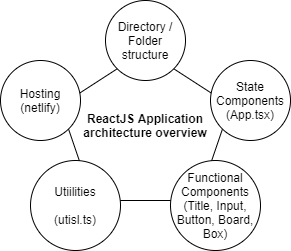

# Assignment

## Part 1

git clone https://github.com/dalmia01/encora-board-game.git
or
git clone git@github.com:dalmia01/encora-board-game.git

[Encora Baord Game](https://encora-board-game.netlify.app/).

## Part 2

simple small app - basic functional components & business logic in app.tsx & utils/utils.ts file

## Part 3

1. user interface - Title, Input, Button , Board, Box - components
2. playing surface - click Box
3. win-state - App state - playerValues, winner.

## Part 4

1. No the game is not fair.
2. player goes first gets a bit advantage.
3. for odd board sizes(3,5,7) the game is unfair.
4. yes odd board, the player who goes first gets 1 more chance than the other. like 9 boxes , first paler gets 5 chances & second player gets 4 chances. so clearly player1 has greater chance of winning.
